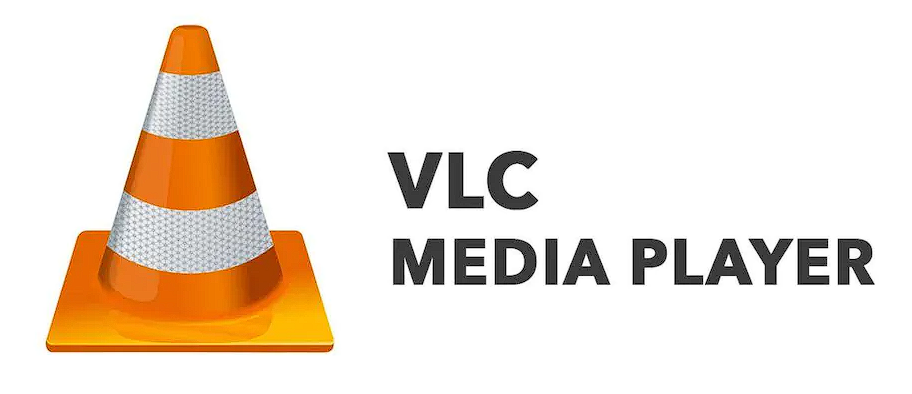
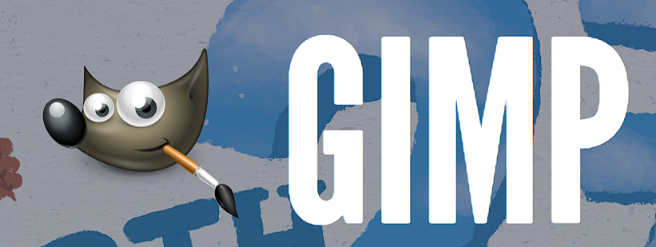
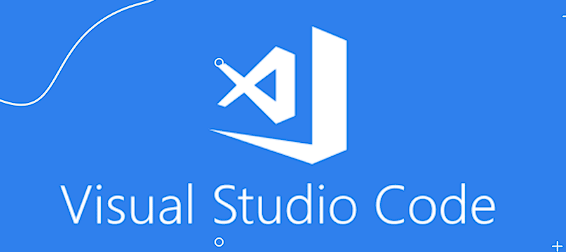
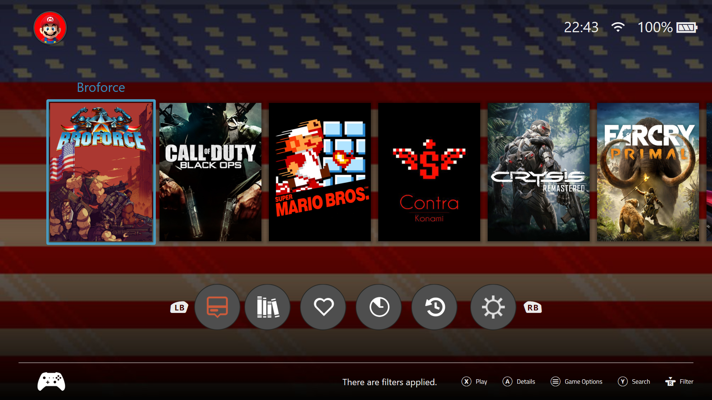
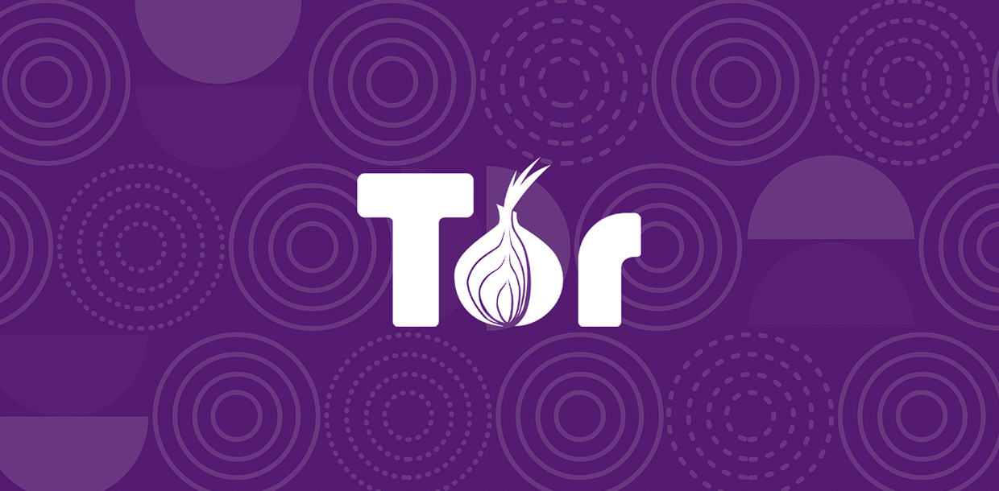

# Best Free Open Source PC Software for daily use

## Media Player Software - VLC Media Player

VLC media player is a nice pack of all the features that you need for a great media playing experiecnce. The UI is simple and Easy to understand. The plyer is powerful enough to satisfy you at all the levels of usage. The plylist options are good and the project has a very active community for development.

Downlad it from <a href = "https://www.videolan.org/vlc/">here</a>.

## Image Editing Software - GIMP

Whether you are a graphic designer, photographer, illustrator, or scientist, GIMP provides you with sophisticated tools to get your job done. You can further enhance your productivity with GIMP thanks to many customization options and 3rd party plugins. 
Gimp is completely free and is one of the most powerful and robust tools for image editing and manipulation.

Downlad it from <a href = "https://www.gimp.org/downloads/">here</a>.

## Best IDE or Code Editor - Visual Studio Code

VSCode is one of the best code editors I have ever used. The availability of extensions and the versetility of the sofware really narrows down the difference between an IDE and a Code editor. You can manage large code bases in various languages in VSCode. Nearly everything you can think of is available as an extension in the extension store. This is a software developed by microsoft and has one of the best community in the world of opensource software.

Download it from <a href = "https://code.visualstudio.com/">here</a>.

## Best Game Manager - Playnite

Playnite is a game manager with one of the most customzable user interface. It supports all the types of games such as emulators. The dowlading of metadata may be a hassle but it gives you an immence satisfaction when you arrange your Game collection in a way you dream about. Playnite has many themes which you can use for getting various eyecathing user interfaces. 

You can dowload it form <a href = "https://playnite.link">here</a>

## The censorship Resistant Browser - Tor

Tor is a project which is inteended to protect the data of US Military. The technology is quickly adopted by the opensource community. You can acess the deep web from the Tor browser. 

You can dowload it form <a href = "https://www.torproject.org/download/">here</a>

## Best Vodeo Editor - ShotCut

Shotcut is a free, open source, cross-platform video editor for Windows, Mac and Linux. Major features include support for a wide range of formats; no import required meaning native timeline editing; Blackmagic Design support for input and preview monitoring; and resolution support to 4k. Edit your videos using Shotcut 64-bit comprehensive software!

You can dowload it form <a href = "https://shotcut.org/download/">here</a>

There are many more free and opnesource alternatives for many subscriptions or paid softwares. The above list is of the softwares that I am currently using for various works. I hpe this helps. 

That's all for this blog! Catch you in next one!! Bye!