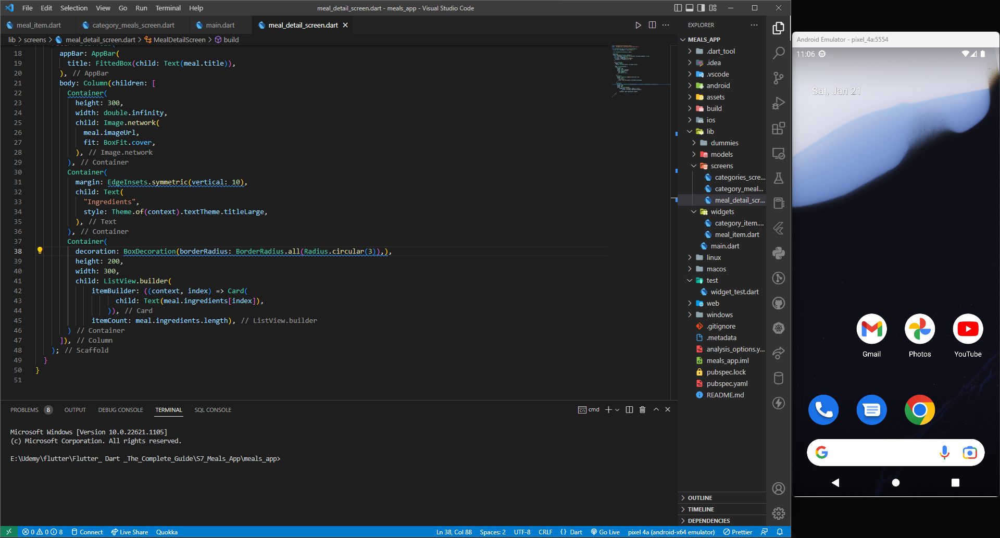

# How to Setup Android Virtual Device without Android Studio on Windows for VSCode


Now in this tutorial we will be seeing how you can set up an AVD for flutter with VSCode without installing Android Studio for AVD management. Before continueing be sure that you have configured android SDK, sdkmanager, and andoid toolchain for flutter. If you have not done that please refer to the previous blog andd follow along to continue.

You need android system images to configure an AVD. For that you first need to choose a system image from all the available system images. First run the following command to list all the available packages in the sdkmanager

```
sdkmanager --list
```
From this scroll down to the system images and choose one according to your need. The alvailable sysem images must look like this:


Now to configure the behaviour of your avd you need to choose a device. Now run the following command to list all the devices available:

```
avdmanager list
```
The list should be something like this:


After choosing your preffered device now we are good to start the AVD configuration process

## Downloading the System Image

To download the selected system image you have to run the following command:
```
sdkmanager --install "<system image package name>"
```
An example command looks like this:

```
sdkmanager --install "system-images;android-31;google_apis;x86_64"
```

This comand will take some time to run as it dowloads and extracts your system image to your PC.

## Creating the AVD

Run the following command with appropriate fields to create an AVD.

```
echo "no" | avdmanager --verbose create avd --force --name "<name of AVD>" --package "<system image package name>" --tag "<google_api or google_atd based on your system image>" --abi "<your platform architecture>" --device "<selected device id>"
```

Now this is a big command but let me break it down for you to get the work done right. 

<ul>
    <li>The first place holder "name of AVD" is just the name you want to give to your AVD</li>
    <li>The "system image package name" is same as the name of the system image package you have installed. Eg: "system-images;android-31;google_apis;x86_64"</li>
    <li>"google_api or google_atd based on your system image" is same as the tag in the system image package name after the second semicolon. Eg: "google_apis"</li>
    <li>"your platform architecture" is "arm64-v8a" for arm chips or "x86" for intel x64 or x32 architectures.</li>
    <li>"selected device id" is the device id you have selected for the list. Eg: "pixel_4a"</li>
</ul>

An example of complete command is given below:
```
echo "no" | avdmanager --verbose create avd --force --name "pixel_4a" --package "system-images;android-31;google_apis;x86_64" --tag "google_api" --abi "x86" --device "pixel_4a"
```

If everythong goes right you should have successfully created your AVD.

## Access your AVD in VSCode using flutter extension

Now in VSCode after opening a flutter project in the bottom right corner click on the selected device.


Now you should be able to see your AVD in the options like this:


now select any option according your need to open the AVD.


with this now you can develop android apps with VSCode by installing flutter and Dart extensions and test your android apps on AVD natively in VSCode.

That's all for this blog! Catch you in next one!! Bye!