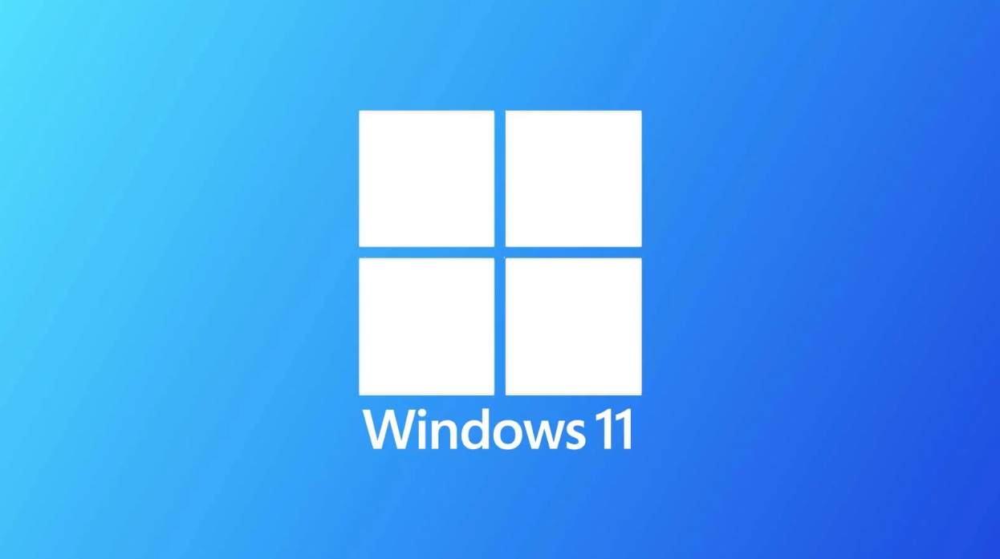
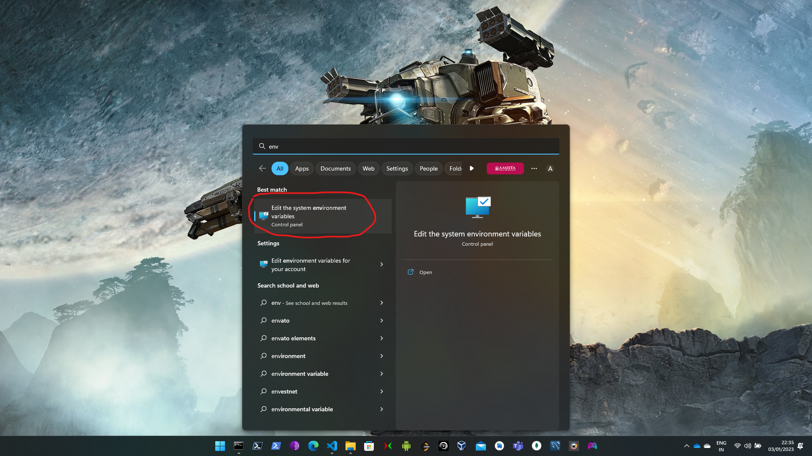
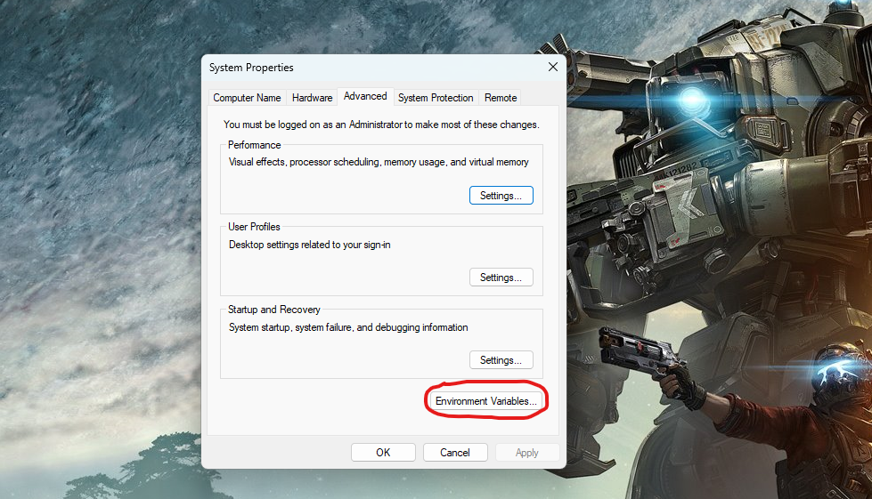
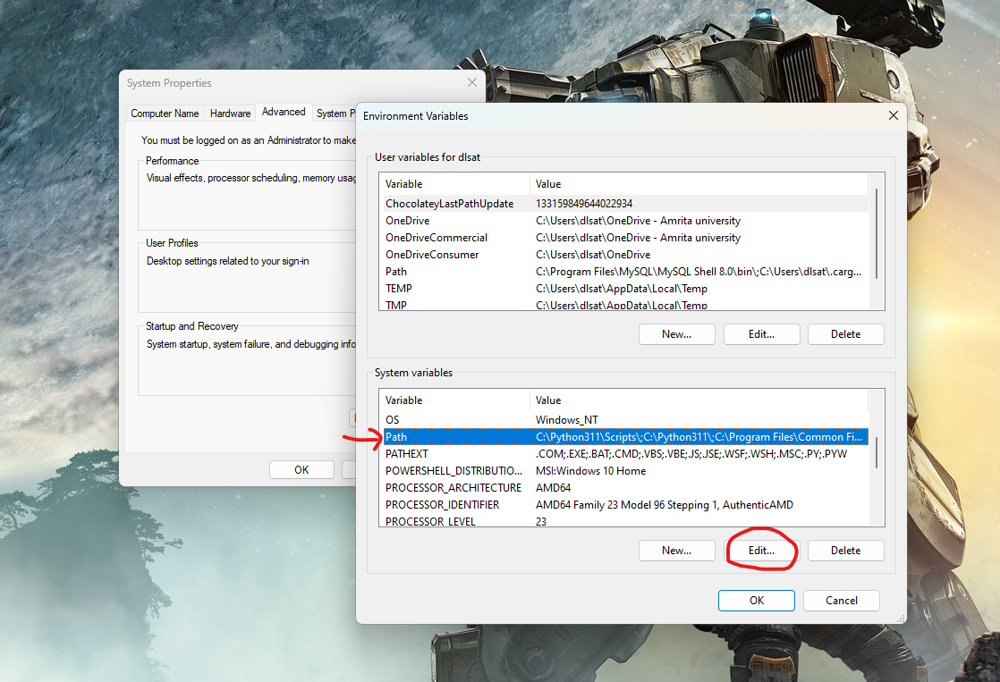
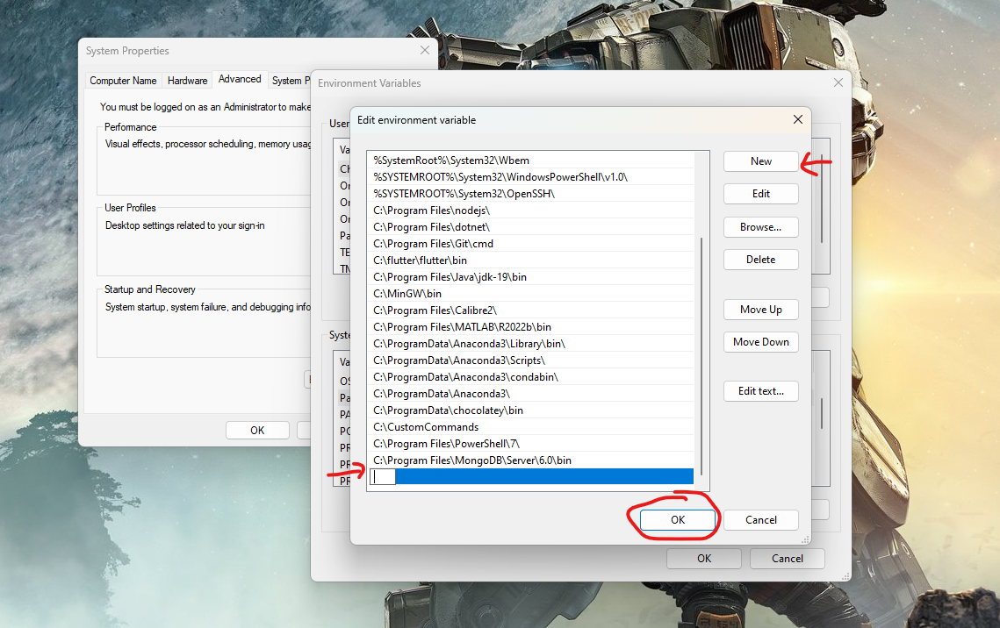

# Creating Custom Commands on Windows
# 

<br>
Do you know that you can create your own custom commands in windows? Let's do that in this tutorial. The basic idea is to use the path environment variable to run the shell scripts with custom command names. In this totorial I will b e creating 3 such custom commands which are available in linux but not in windows.

<br>

## 1. Create a Folder for your shell scripts of custom commands:

Create a folder at any location (preferebly in C drive) and copy the path to that folder. Now for the command line to acces all the files in that folder we add the path to the path environment variable. Now seach for "env" in the search and select "Edit system environment variables"



Then select "Environment variables"



Now select the path option under system variables, then select the edit option


Now click on the new button and paste the copied path and then select ok.

Now keep selecting ok till all the windows are closed.

## 2. Create a Shell-Scripts for custom commands:

### ls command:
If you dont know the ls command is used to list all the contents of current working directory in unix systems.
Now in your custom commands folder create a text file "ls.txt" and paste the following shell script in it.

```
@echo off
dir /B
```

now in file menu select "save as" and save your file with the name "ls.bat". after this you will be able to use the ls command from your command line.

### gedit command:
gedit is used to edit a file graphically using a text editor.
now we will repeat the same process to simulate the gedit command of linux using windows notepad. create a file "gedit.txt" and paste the following shell script in the file then save it as "gedit.bat". 

```
@echo off
notepad %1
```


### touch command:
touch command is used to create a new file in the current directory

now try to repeat the same process to get the touch command working.
```
@echo off

setlocal
set CreateFiles=True
 
:start
    if %1.==. goto :end
    if "%1"=="-c" (
        set CreateFiles=False
        shift
        goto :start
    )
    if exist "%1" (
        copy /b "%1" +,, > nul
    ) else (
        if "%CreateFiles%"=="True" (
            type nul > "%1" 
        )       
    )
    shift
    goto start
 
:end
endlocal
```

## Conclusion:
Now you have sucessfully configured your system environment to use custom commands defined by the shell scripts in the custom commands folder. If you are curious about how the script in these batch files is working you can explore shell scripting for windows. With more knowlwdge in shell scripting you can abstract complex tasks that you usually perform to simple commands. Also you can setup some scripts to run on start up to automate some stuff you often do.

<br>
Yeah! That's it for this blog. Keep learning!!