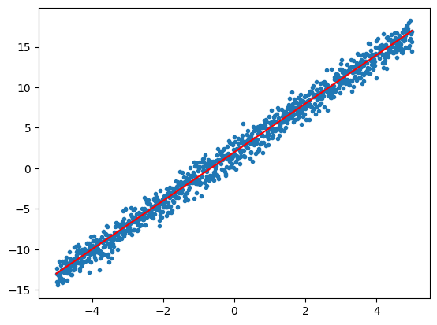
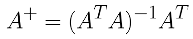

# Linear Regression

  

In statistics, linear regression is a linear approach for modelling the relationship between a scalar response and one or more explanatory variables. That means we are going to find a linear equation that best fits the data. The data may not be perfectly linearly related but we minimise the error. We predict the value of a new sample by using the best fit linear equation that we found for our data. 

The idea to find the required best fit linear equation is pretty simple if you know the basic calculus. The idea is to write an error function and then minimise it by equating the derivative of the error function to zero.

The error used in linear regression is mean squared error. This describes the deviation of the best fit prediction forom the actual data. Let's take all the original outputs of the samples as a vector and the outputs prdicted for the same samples as another vector. We can write the MSE as the square of norm of difference between two two vectors divided by the number of samples. For minimising this we have to find the gradient of this function and make it to zero. By doing that we get the optimal weights and intercept of the required linear equation as the pseudo-inverse of the feature matrix multiplied by the responce vector.

The pseudo inverse of a matrix "A" is defined as follows:

For the whole mathematical proof of getting the above proof please go <a href = "./proof.png">here</a>.

For seeing the implementation the the above theory using python please go <a href = "./implementation.ipynb">here</a>. 
 

The finding of the pseudo inverse may not be always feasible when the data is very huge. In this conditions we can use an iterative method called Gradient Descent for finding the optimal weights for the given data. We will cover it in the next one.

That's all for this blog! Catch you in next one!! Bye!