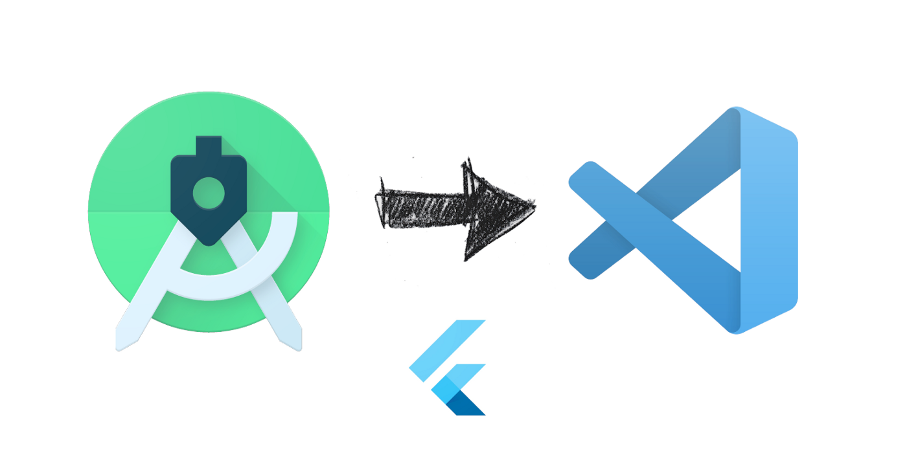
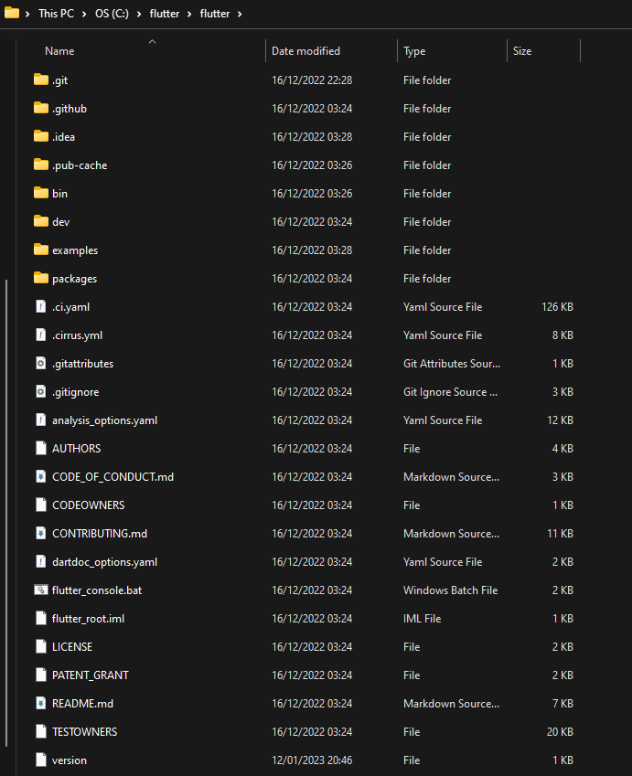
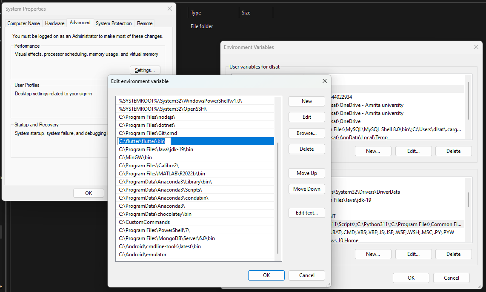
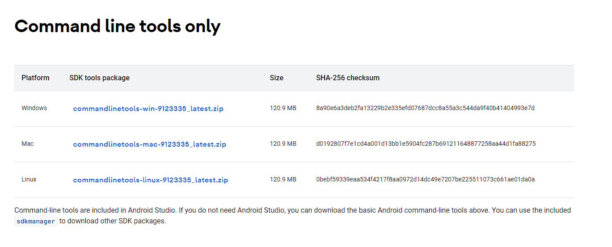
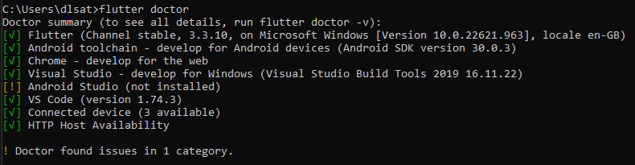

# How to Get Started with Flutter without Android Studio on Windows


I am one of those people who likes to stick to VSCode no matter what they are developing. Now in this tutorial we will be seeing how you can set up flutter with VSCode without installing Android Studio for Android tool chain. Now download the flutter compressed file from <a href = "https://docs.flutter.dev/get-started/install/windows">here</a>. Now create a folder in in your System drive and name "flutter". Now extract the dowloaded file and place the extracted flutter file in the flutter file that you created. 

Your tree structure should look something like this:



Now add the "bin" folder to your path environment variable like this:



Now download the command line tools form <a href = "https://developer.android.com/studio">here</a>



After extracting the dowloaded zip file and you will get "cmdline-tools" folder. Now create a folder named "Android" in your system drive and paste the command line tools in there. Now inside the "cmdline-tools" open the "bin" folder in command prompt and execute the following command.

```
sdkmanager.bat --install "cmdline-tools;latest" --sdk_root=../../
```
Now this will create a folder named latest inside your "cmdline-tools" named latest. Now add the following address to path

```
C:\Android\cmdline-tools\latest\bin
```

Now run the following commands form a new command line 

```
sdkmanager.bat "build-tools;30.0.3" 
sdkmanager.bat  "platforms;android-31"
```

Now go create an system environment variable named "ANDROID_SDK_ROOT" and set that to ```"C:\Android"``` which is the root of your Android SDK root. 

Now to configure flutter with this custom installation run the following command:
```
flutter config --android-sdk %ANDROID_SDK_ROOT%
```

Now run the folloing commands to accept the Andoid License Agreement:
```
flutter doctor --android-licenses
```

Now run flutter doctor to check your current development configuration:
and you should see something like this


with this now you can develop android apps with VSCode by installing flutter and Dart extensions. I hope this helped you to set up your environment as you like.

That's all for this blog! Catch you in next one!! Bye!