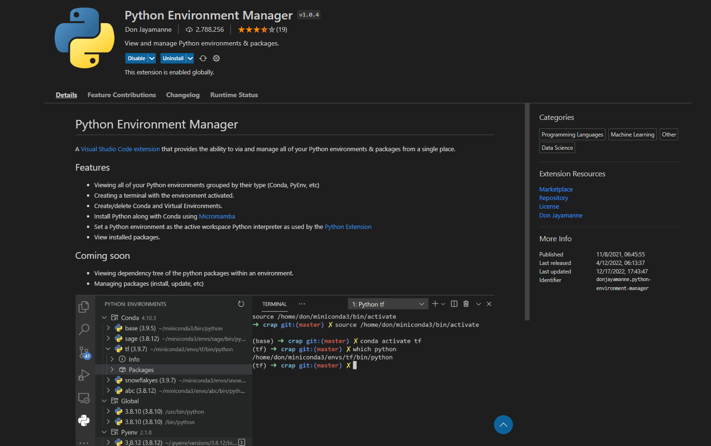
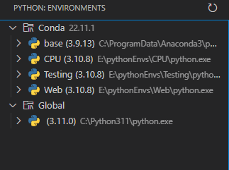
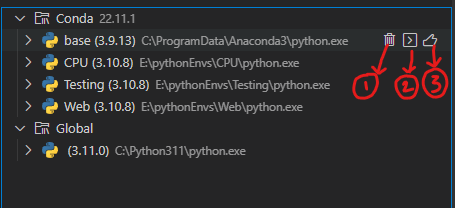
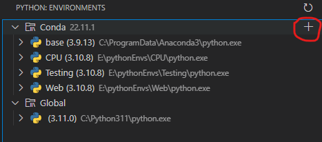

# Python Environment Management Using Miniconda and VSCode


Managing the python environments correctly is one of the most important things to do for a Python user. Without strict environment management and organisation it is really a hassle to work in python. In this blog lets see how we can manage out python environments effectively using Miniconda and VSCode.


## Miniconda Installation
<hr>
Downloading Miniconda in windows is just like installing any other software. Download the line form <a href = "https://repo.anaconda.com/miniconda/Miniconda3-latest-Windows-x86_64.exe">here</a> and just run the executable file. Just follow the on screen instructions and you are good to go. 

Miniconda itself is enough to maintain your pytion environments provided that you know how to use the command line interface of miniconda. If you want to acces anaconda form any where in the command line you will have to add conda to path. For that just fire up the Anaconda Prompt that you got after installing Miniconda and type the following command.

```
where conda
```

You will get the locations of the conda executables as an output. Now add all the folders with conda executables to your path system environment variable.

If you want to manage all the environments with Miniconda alone then Here are the most common and useful commands for you

To create new env:	(on base)
```
conda create --prefix <path to env without quotes> python=3.10		      
```
To list all env:
	(on base)
```
conda env list
```

To activate an env: (on base)
```
conda activate E:\pythonEnvs\condaCr
```
to deactivate an env: (on env)
```
conda deactivate
```

to install a package in env with pip: (on env)
```
pip install packagename
```

to remove an env: (on base)
```
conda env remove -n env_name
```


## Environment Management Using VSCode
<hr>
Open VSCode and install the "Python Environment Manager" extension. This will create a python icon in your sidebar.


After installation click on the extension(python icon) and you will be able to see all the environments here like this



If you hover your mose on any of these Environments you will find the following three options:



1 -- Delete Environment 

2 -- Activate Environment in an integrated terminal

3 -- Set as current active interpretor

To create a new environment click on the "+" icon shown below and follow the on screen instructions



I hope this helped you to manage your environments effectively. That's all for this blog. Bye!!